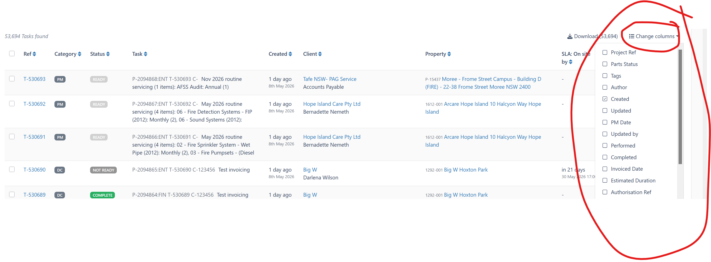

# List Options Notes

## Problem Summary

Some operational list screens need more columns than should be shown by default. A different system shown by the user lets users choose which list columns are visible through a "Change columns" control.

The proposed PowerCRUD version is a default-vs-optional column model, similar to the existing default-vs-optional filter model.

An example from a cpompletely different system ius Uptick as per image below:
{width=50%}

## Initial Feasibility Assessment

This looks feasible in PowerCRUD's current architecture.

PowerCRUD already resolves list display from configured `fields` and `properties`, builds generic header and cell payloads, and renders those payloads through the shared list template. That means column visibility can probably be handled by filtering the resolved headers and row cells before rendering, instead of creating a second table system.

The closest existing pattern is optional filter visibility:

1. Treat the declared filter set as the full allow-list.
2. Treat `default_filterset_fields` as the initially visible subset.
3. Preserve explicitly visible optional filters through request state.
4. Validate submitted visibility choices against the effective allow-list.

List-column visibility can follow the same conceptual model.

## Public API Decision

Use the existing `fields` and `properties` configuration as the public allow-list for user-selectable list data columns. This keeps backwards compatibility and matches PowerCRUD's current public docs, where `fields` already means list-view columns.

Use `default_list_fields` for the default visible subset:

```python
fields = ["ref", "category", "status", "task", "created", "client", "property", "sla"]
properties = ["sla_state"]
default_list_fields = ["ref", "status", "task", "created", "client"]
```

In that shape:

1. `fields` and `properties` define the full allowed rendered-column universe.
2. `default_list_fields` defines what appears when the user has no saved preference.
3. Everything allowed but not default-visible is available through a column chooser.

This mirrors the existing filter pattern:

```python
filterset_fields = ["owner", "status", "created_date", "category"]
default_filterset_fields = ["owner", "status"]

fields = ["ref", "status", "created_date", "category", "owner", "notes"]
properties = ["sla_state"]
default_list_fields = ["ref", "status", "created_date", "sla_state"]
```

Do not introduce `optional_list_fields` in the first version. The optional set is derived from the resolved allow-list minus `default_list_fields`, which avoids a second allow-list and the precedence questions that would come with it.

Do not introduce `list_fields` in the first version. It would duplicate or compete with the existing public meaning of `fields`, which already means list columns. Keeping `fields` and `properties` as the allow-list is clearer and less disruptive.

The public contract should be:

1. `default_list_fields = None` preserves current behaviour and renders all resolved `fields` and `properties`.
2. `default_list_fields = [...]` opts the view into default-vs-optional column visibility.
3. Every `default_list_fields` entry must exist in the resolved `fields` and `properties` allow-list.
4. Duplicate names are deduped while preserving first occurrence, consistent with existing list-style config handling.
5. Empty `default_list_fields` should be invalid unless a later deliberate decision supports tables with no data columns.
6. Selection checkboxes, row actions, bulk controls, and other system cells are outside the user-toggleable data-column API.

Internally, resolver and template context code can use column-oriented names such as `allowed_columns`, `default_columns`, and `active_columns`. Public configuration should keep the `fields` naming to align with the existing PowerCRUD API.

## Properties

Properties should be eligible configurable columns.

Validation should check visibility config against the effective rendered-column universe:

1. Resolved model fields from `fields`.
2. Resolved properties from `properties`.

Properties remain display-only. Inline editing should stay model-field-only unless a separate future feature deliberately changes that contract.

## Persistence Direction

The preferred direction is user-profile-backed column choices, not browser-local-only state.

The existing favourites contrib app is DB-backed, not cache-backed. It uses a normal model with a `JSONField` state per user, view key, and favourite name.

For column choices, the cleaner first design is probably a separate per-user, per-view preference model rather than forcing current column choices into named favourites immediately.

Candidate concept:

```text
PowerCRUDListPreference
- user
- view_key
- state JSONField  # for example {"visible_columns": [...]}
- updated_at
```

Named saved filter favourites could later be extended to include `visible_columns`, because a full saved view is naturally filters plus visible optional filters plus sort plus page size plus visible columns.

## URL State And Sharing

There are two possible layers:

1. User preference as the normal source of truth.
2. Optional `visible_columns` query parameters for shareable or one-off list layouts.

If URL state is supported, submitted column names must be validated against the allowed columns before rendering.

## JavaScript Direction

Avoid localStorage for this feature if user-profile-backed preferences are the goal.

Some JavaScript is still useful for the column chooser UI, but it should stay small and server-led:

1. Open and close the column chooser.
2. Collect checked column names.
3. Submit a small form or HTMX request.
4. Support a reset-to-default action.

Do not copy the full optional-filter localStorage machinery unless there is a strong anonymous-user requirement.

The current `powercrud.js` is already becoming large. This feature should either be implemented as a small isolated module/section or be paired with a light JS organization pass before adding more state machinery.

## Inline Editing Considerations

Inline editing needs explicit handling.

If a column is hidden, any inline-edit form for that row should not unexpectedly expose the hidden field. Current inline code derives visible form fields from row cells, which may help, but required hidden fields still need to be preserved safely.

Potential rule:

1. Hidden columns are not displayed or inline-editable in the row.
2. Required or preserved form fields needed for save correctness remain hidden inputs where the existing inline-preservation machinery requires them.
3. `inline_edit_fields` remains validated against editable model fields, not against currently visible columns.

## Sorting Considerations

Sorting by a hidden column needs a rule.

Candidate default:

1. If a user hides the currently sorted column through the column chooser, clear the sort.
2. If a hidden sort appears in the URL, either ignore it or allow it but do not show a header indicator.

Clearing it on hide is probably less surprising for the user.

## Filter Considerations

Filters do not need to be visible as columns. Filtering by a hidden column can be useful.

Important distinction:

1. `filterset_fields` controls which fields can filter the queryset.
2. List-column choices control only display.

The implementation should avoid coupling filter availability to visible columns. The main validation relationship is that both systems should validate submitted names against their own allow-lists.

## Product Value

This feature is most valuable for wide operational lists, not every CRUD screen.

Expected value:

1. Reduces default list clutter while preserving access to useful data.
2. Lets different users shape the same list for different jobs.
3. Avoids downstream template forks or duplicate CRUD views just to change columns.
4. Makes computed `properties` more useful without crowding the default table.
5. Pairs naturally with saved filter favourites and eventual saved views.
6. Makes PowerCRUD feel closer to mature operational admin tools.

The main risk is complexity. The first implementation should be disciplined: allow-listed columns, simple chooser UI, DB-backed user preference, no drag-and-drop ordering, and no localStorage unless explicitly justified.

## Phase Notes

### Phase 1: Lock the public column model

This phase should settle the public API before implementation starts.

The public API decision is to keep existing `fields` and `properties` as the full column allow-list and add `default_list_fields` as the default visible subset. There should be no first-version `optional_list_fields` or `list_fields` setting.

The visible-column state contract is partly settled: when `default_list_fields` is unset, existing behaviour is preserved and all resolved list fields/properties render; when it is set, that subset is used before any user preference exists. System columns such as selection, row actions, and bulk controls sit outside user-toggleable data columns.

Remaining decisions: what happens when saved or submitted columns are stale, whether active user state can become empty, and the exact fallback when active visible state is empty or invalid.

### Phase 2: Make list rendering column-aware

This phase should introduce one resolver for allowed, default, and active visible list columns, then route existing header and row-cell generation through that resolved set.

The key requirement is that existing views keep current behaviour unless they opt in. Hidden columns should disappear from headers and cells, but row selection, row actions, bulk action containers, and counters should remain independent of column visibility.

Rendering still needs to preserve the current field and property order, sortable header metadata, field/property formatting, cell alignment, column help text, semantic tooltips, overflow tooltips, `link_fields`, and `get_list_cell_link(...)` for visible cells.

### Phase 3: Add the column chooser and preference flow

This phase should add the visible "Change columns" control and the server-led apply/reset flow.

The chooser should show one checkbox per allow-listed data column, avoid presenting selection/actions as normal data columns, validate submitted column names against the resolved allow-list, and re-render the list without dropping current filters, sort, page size, or selection state.

JavaScript should stay small: open and close the chooser, collect checked column names, submit the state, and support reset. It should not introduce localStorage unless anonymous-user behaviour later requires it.

### Phase 4: Add persistence and stale-state handling

This phase should settle and implement the first persistence source of truth.

The likely direction is a per-user, per-view DB-backed preference keyed by a stable view key and storing visible columns in structured JSON. The phase also needs to decide whether this belongs in core PowerCRUD or an optional contrib app, what anonymous users get, and whether visible columns are URL-shareable in the first release.

Stale state must degrade cleanly: drop column names that are no longer allowed, fall back to defaults if a preference becomes empty or invalid, and avoid raising errors after a view config changes.

Saved filter favourites should stay separate unless deliberately expanded. If that integration is deferred, column preferences and named filter favourites must not overwrite each other.

### Phase 5: Protect filters, sorting, pagination, and URL state

This phase should prove that changing columns does not corrupt the surrounding list state.

Filters must remain independent from visible columns. Active filters should not be removed because the filtered field is hidden, optional filter controls should not disappear because the matching column is hidden, and filter state should survive column changes.

Sorting needs an explicit hidden-column rule. The plan should decide whether hiding the currently sorted column clears the sort or preserves an invisible sort, and how hidden sort parameters from the URL are handled. Sort indicators should only render for visible sortable columns.

Pagination, page size, query parameters, and HTMX targets also need explicit behaviour so column changes refresh the intended list area without disturbing unrelated controls.

### Phase 6: Protect inline editing, links, tooltips, row actions, and bulk selection

This phase should cover the list behaviours most likely to break if columns are filtered too bluntly.

Hidden columns should not display inline edit triggers, but `inline_edit_fields` should remain an editability config rather than a visibility config. Any required hidden-field preservation needed by inline saves must continue to work.

Row-level update/delete policies should remain independent of visible columns. `link_fields`, `get_list_cell_link(...)`, and `get_list_cell_tooltip(...)` should apply only to visible eligible cells, while preserving the existing rule that inline-editable cells are not converted to links.

Bulk selection should remain stable through column changes: selected IDs, select-all state, persisted selection, and bulk action visibility should not be lost merely because visible columns changed.

### Phase 7: Add sample app coverage, tests, and documentation

This phase should make the feature visible, tested, and understandable.

The sample app should demonstrate default and optional columns, include both model fields and properties, and exercise at least one realistic interaction with filters, sorting, inline editing, links, or bulk selection.

Tests should cover config validation, visible-column resolution, header/cell rendering, filters on hidden columns, sorting behaviour, stale preferences, inline editing around hidden/visible columns, linked cells, and HTMX apply/reset flows if the chooser uses HTMX.

Docs should include copyable configuration snippets, final config reference entries, hook reference updates if hooks are added, and limitations such as no arbitrary fields, no user drag ordering unless implemented, and filter availability remaining independent of column visibility.

Deferred follow-up decisions should include whether saved filter favourites become full saved views, whether export/download follows visible columns or a separate export schema, and whether user-controlled column ordering belongs in a later phase.

## Open Questions

1. Should column order be configurable by the user in phase 1, or should phase 1 only support show/hide?
2. Should user preferences live in core PowerCRUD or an optional contrib app?
3. Should saved filter favourites grow a `visible_columns` state key immediately, or only after current column preferences exist?
4. Should anonymous users get session-backed column choices, default-only behavior, or no persistence?
5. Should `visible_columns` be URL-shareable in phase 1?
6. What should happen when a saved preference references a column that the view no longer allows?
7. What exact fallback should apply when active visible-column state is empty or invalid?

## Likely Code Areas

1. `src/powercrud/mixins/config_mixin.py`
2. `src/powercrud/validators.py`
3. `src/powercrud/templatetags/powercrud.py`
4. `src/powercrud/templates/powercrud/daisyUI/object_list.html`
5. `src/powercrud/templates/powercrud/daisyUI/partial/list.html`
6. `src/powercrud/static/powercrud/js/powercrud.js`
7. `src/powercrud/contrib/` or a new core preference model area
8. `docs/mkdocs/guides/` and `docs/mkdocs/reference/config_options.md` later

## Decisions Tentatively Favoured

1. Include model properties as eligible configurable columns.
2. Keep inline editing model-field-only.
3. Use DB-backed user preference as the primary persistence mechanism.
4. Avoid localStorage for column choices.
5. Keep the first UI simple: show/hide columns and reset to defaults.
6. Do not couple filter availability to visible columns.

## Decisions Confirmed

1. Keep `fields` and `properties` as the public allow-list for rendered list data columns.
2. Add `default_list_fields` as the default visible-column subset.
3. Do not add first-version `optional_list_fields`; derive optional columns from the allow-list minus defaults.
4. Do not add first-version `list_fields`; it would duplicate the existing public meaning of `fields`.
5. Preserve existing behaviour when `default_list_fields` is unset.
6. Keep selection, row actions, bulk controls, and other system cells outside the user-toggleable data-column API.
